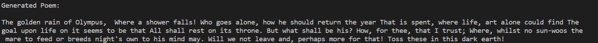

# Poetry-Engine
Generates "poetry" using AI. I really wouldn't call it poetry but it's close enough. 

# Usage
**Make sure you have happytransformer and gingerit installed via pip**

1. Download the source code to this repository
2. Download [this]()zip archive with the new pytorch model and drag it into the model folder 
3. For the legacy model download [this](https://www.mediafire.com/file/w26mtd5kjj6qk6p/pytorch_model.zip/file) zip archive and drag the contents to legacy\model
4. Run either one of the .py files. poetry_chat.py is more open ended while poetry.py has greater accuracy but requires you to write the first line of poetry. 

# Legacy
The folder legacy just contains old code and an old pytorch model

# Screenshot

